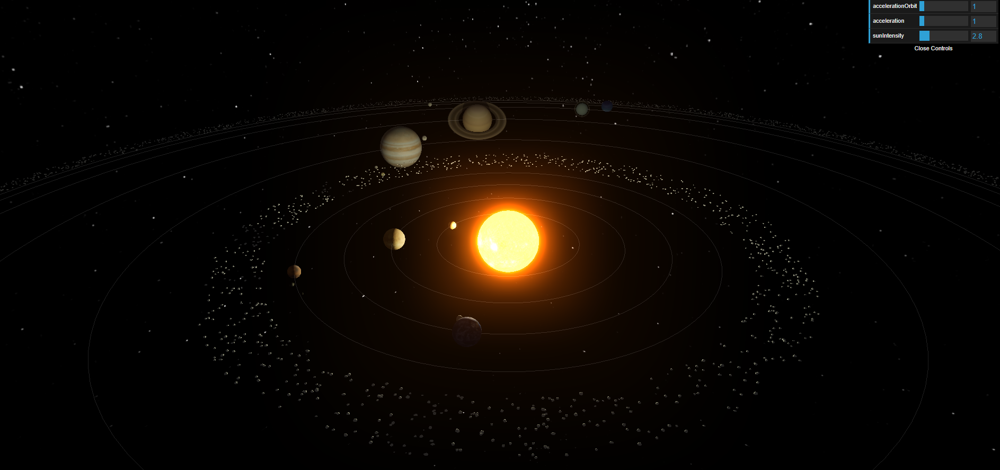
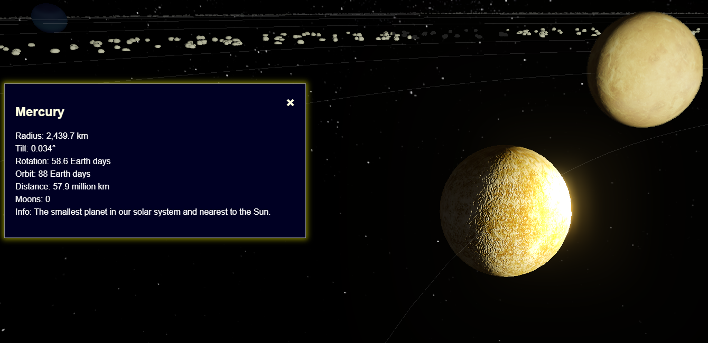
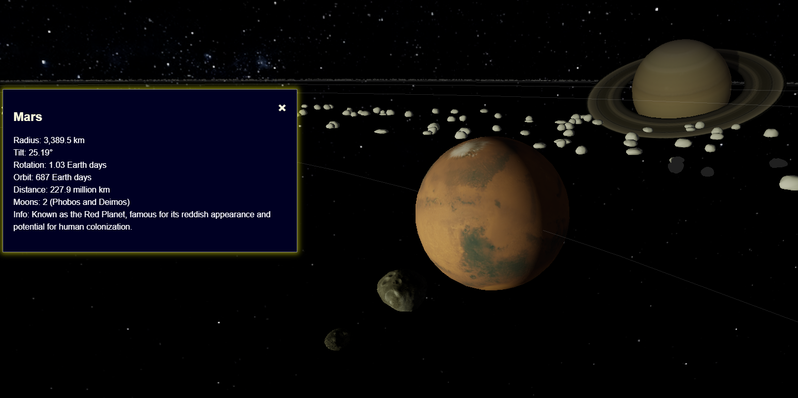

# 3D Solar System Simulation

Welcome to the **3D Solar System Simulation**, an immersive and interactive 3D visualization of our solar system, built using THREE.js and Vite. This project offers an intuitive way to explore celestial bodies with advanced rendering techniques and interactive features, all crafted by Karol Fryc.

## Project Overview

This simulation accurately represents planets, moons, and other space objects with detailed textures, realistic lighting, and interactive controls. You can explore the solar system from any angle, adjust settings in real-time, and enjoy special effects like glow and shadows for a visually stunning experience.

For a live demo, please visit: [3D Solar System Simulation Overview]()








## Key Features

### 1. **Core Setup**
- **Scene, Camera, Renderer**: Utilizes the basic THREE.js setup for rendering a dynamic 3D environment.
- **Interactive Controls**: Easily navigate through space using user-friendly controls.

### 2. **Postprocessing Effects**
- **BloomPass**: Adds a dynamic glow to the Sun, enhancing its realism.
- **OutlinePass**: Highlights selected planets with a soft outline when hovered over.
- **EffectComposer**: Efficiently manages and combines multiple postprocessing effects to optimize rendering.

### 3. **Interactive Starfield**
- A realistic, immersive starry background, adding depth to the scene.

### 4. **User Interaction**
- **dat.GUI Integration**: Allows users to customize simulation parameters such as planetary orbit speeds and Sun's glow intensity.

### 5. **Advanced Lighting**
- **AmbientLight**: Provides soft, omnidirectional lighting for the entire scene.
- **PointLight**: Positioned at the Sun to cast accurate, realistic shadows.

### 6. **Realistic Planetary Models**
- Detailed attributes such as size, position, tilt, textures, bump materials, rings, and atmospheres.
- Includes moons with accurate textures and orbital paths. Special focus on non-spherical moons like Phobos and Deimos.
- **Earth**: Features ShaderMaterial to simulate day/night transitions and dynamic cloud movement.

### 7. **Accurate Orbits & Rotations**
- Planets and moons orbit the Sun and rotate on their axes with scaled distances and velocities, offering a close approximation of real-world dynamics.
- Planet sizes are adjusted for visual clarity; smaller planets like Mercury, Venus, Earth, Mars, and Pluto are to scale, while larger gas giants are reduced for balance.

### 8. **Real-Time Shadows**
- Realistic shadows cast by the PointLight at the center of the Sun.

### 9. **Asteroid Belts**
- **Procedurally Generated**: 1,000 asteroids in the belt between Mars and Jupiter, and 3,000 in the Kuiper Belt.
- Optimized for performance with simplified textures for smooth operation.

### 10. **Selection & Zoom Features**
- **Hover Effects**: Planets are outlined when hovered over.
- **Zoom In**: Click on a planet to zoom in and display detailed information.
- **Zoom Out**: Easily return to the default solar system view.

## Resources & Assets

This project incorporates various free resources for textures and 3D models:
- [NASA 3D Resources](https://nasa3d.arc.nasa.gov/images)
- [Planet Pixel Emporium](https://planetpixelemporium.com/index.php)
- [TurboSquid](https://www.turbosquid.com/)
- [TurboSquid](https://codingtorque.com/3d-solar-system-using-html-css-and-javascript/)

## Installation and Setup
1. Clone the repository:
    ```sh
    git clone https://github.com/your-username/3d-solar-system.git
    ```
2. Navigate to the project directory:
    ```sh
    cd 3d-solar-system
    ```
3. Install dependencies:
    ```sh
    npm install
    ```
4. Start the development server:
    ```sh
    npm run dev
    ```
5. Open your browser and navigate to `http://localhost:3000` to see the 3D Solar System in action.

## Conclusion
This project is a comprehensive representation of our solar system, bringing together realistic modeling, advanced visual effects, and interactive features. Explore the planets, their moons, and the vast asteroid belts, all from the comfort of your screen.

Feel free to contribute, suggest improvements, or use this project as a foundation for your own THREE.js experiments. Happy exploring!
